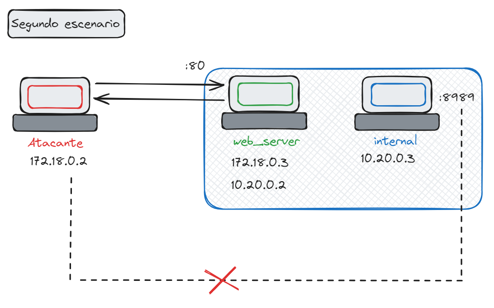

# Lab_SSRF
[](https://docs.docker.com/compose/)

Laboratorio diseñado para practicar la vulnerabilidad web SSRF (Server Side Request Forgery)

## 💻 [Escenario 1](https://github.com/PumaHat/Lab_SSRF?tab=readme-ov-file#escenario1)


El primer escenario planteado en estos laboratorios

## 💻 [Escenario 2](https://github.com/PumaHat/Lab_SSRF?tab=readme-ov-file#escenario2)



# Instrucciones para desplegarlos
Para desplegar estos contenedores lo primero es clonar el repositorio en nuestra máquina local y dependiendo del laboratorio que se desee desplegar tocará de entrar en la carpeta correspondiente y desplegarlo con docker-compose

## Clonar el repositorio
```bash
git clone https://github.com/PumaHat/Lab_SSRF.git
cd Lab_SSRF
```
**No se usa el parámetro -d en docker porque se ha colocado una ejecución de comando en el que se muestra la ip de cada contenedor por lo que no se recomienda usar -d el detalle es que esa terminal quedará "inutilizable" así que tocará abrir otra**
### Escenario1
Estos son los comandos para desplegar el primer escenario

```bash
# Escenario1
cd escenario_1/
docker-compose up
```

### Escenario2

Estos son los comandos para desplegar el segundo escenario
```bash
# Escenario2
cd escenario_2/
docker-compose up

# Abrir otra pestaña de la terminal y nos conectamos al contenedor de atacante
docker exec -it hacker bash
```

El segundo escenario contempla operar desde el contenedor **"hacker"** por la naturaleza de docker y es que si se ataca desde el S.O. principal si se tiene visibilidad con la parte **internal** por lo que la idea es que no se tenga acceso, así creando este contenedor atacante para que pueda simular de forma correcta


# Sugerencia
Si quieres practicar es recomendable que ejecutes los siguientes comandos antes de desplegar otro laboratorio (o ejecutar el script clearDocker.sh `bash clearDocker.sh`)

```bash
# Para limpiar todos los contenedores que ha creado Docker con anterioridad

docker rm --force $(docker ps -aq)
docker rmi --force $(docker images -aq)
docker network rm $(docker network ls -q)
docker volume rm $(docker volume ls -q)
```
